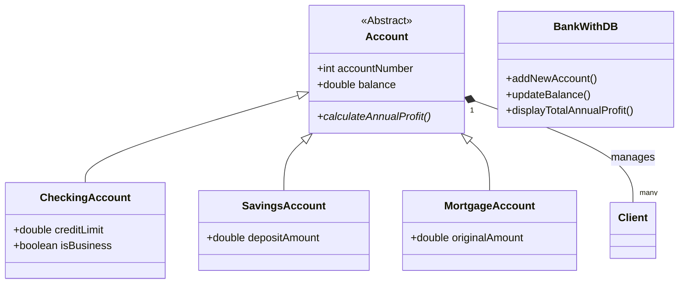

# Banking-System-JDBC 🏦

A robust banking management system developed in Java, demonstrating Object-Oriented Programming (OOP) principles and database integration using JDBC and PostgreSQL.

## 🚀 Overview
This project simulates a bank's backend operations. It supports different account types (Checking, Savings, Mortgage), client management, and financial reporting. The system allows for persisting data into a PostgreSQL database, ensuring data integrity with transaction management.

## 🛠 Tech Stack
* **Language:** Java (JDK 8+)
* **Database:** PostgreSQL
* **Connectivity:** JDBC (Java Database Connectivity)
* **Concepts:** OOP (Inheritance, Polymorphism), Factory Pattern, SQL Transactions.

## ⚙️ Key Features
* **Account Management:** Create, Update, and Delete accounts.
* **Polymorphic Accounts:**
    * **Checking Account:** Supports credit limits and business/personal classification.
    * **Savings Account:** Calculations based on deposit amount and years.
    * **Mortgage Account:** Handles mortgage payments and tenure.
* **Client Management:** Link multiple clients to accounts (Many-to-Many relationship simulation).
* **Financial Reporting:**
    * Calculate annual profits based on account logic.
    * Generate management fee reports.
    * Identify VIP business accounts.
* **Database Reliability:** Uses `PreparedStatement` to prevent SQL Injection and manages transactions (`commit`/`rollback`) for data consistency.

## 🏗 Class Structure

